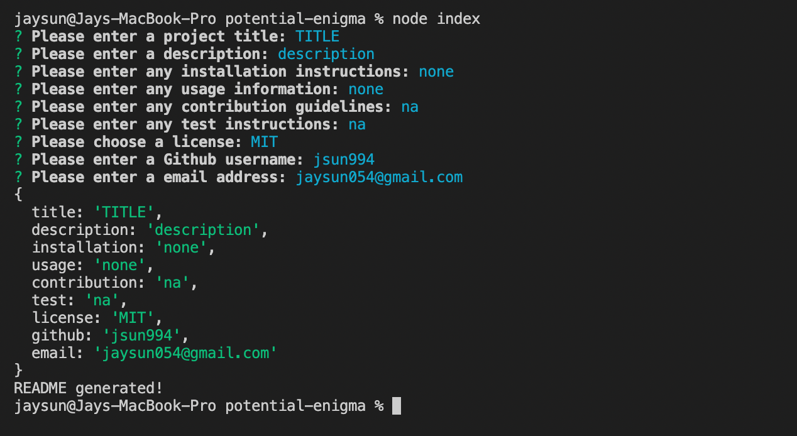
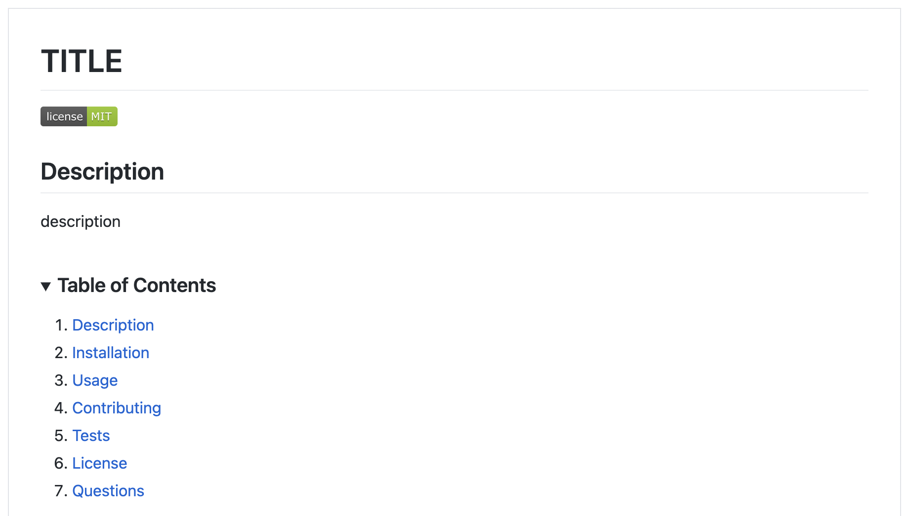
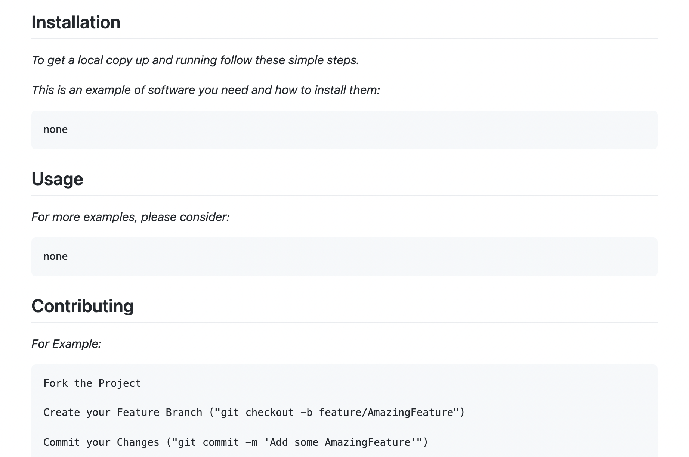
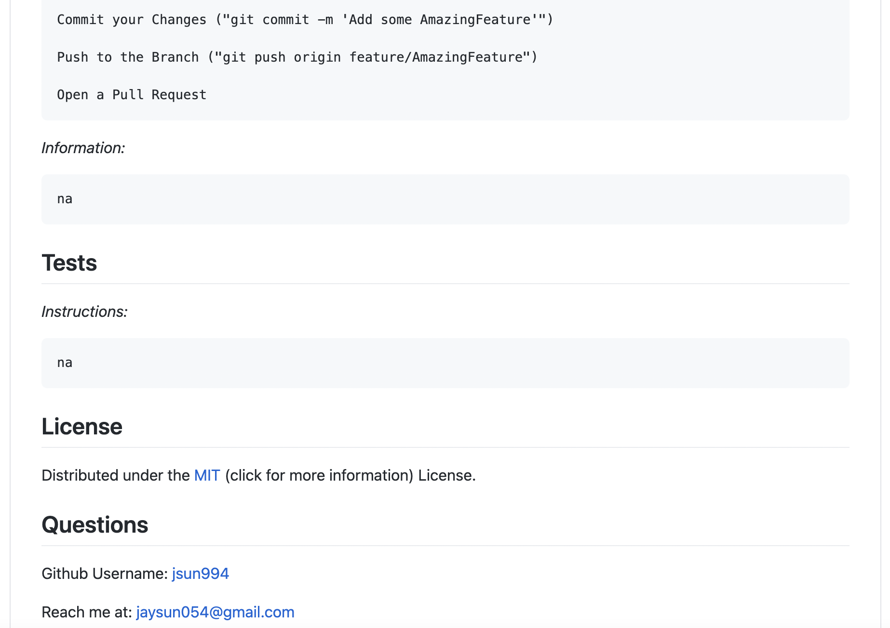

# Professional README Generator

[![Contributors][contributors-shield]][contributors-url]
[![Forks][forks-shield]][forks-url]
[![Stargazers][stars-shield]][stars-url]
[![Issues][issues-shield]][issues-url]
[![MIT License][license-shield]][license-url]

<!-- PROJECT LOGO -->
<br />
<p align="center">
  <a href="https://github.com/jsun994/mdpro-readme-gen">
    
  </a>

  <p align="center">
  A professional README generator for developers.
    <br />
    <a href="https://github.com/jsun994/mdpro-readme-gen"><strong>Explore the docs »</strong></a>
    <br />
    <br />
    <a href="https://github.com/jsun994/mdpro-readme-gen">View Demo</a>
    ·
    <a href="https://github.com/jsun994/mdpro-readme-gen/issues">Report Bug</a>
    ·
    <a href="https://github.com/jsun994/mdpro-readme-gen/issues">Request Feature</a>
  </p>
</p>

<!-- TABLE OF CONTENTS -->
<details open="open">
  <summary><h2 style="display: inline-block">Table of Contents</h2></summary>
  <ol>
    <li>
      <a href="#about-the-project">About The Project</a>
      <ul>
        <li><a href="#built-with">Built With</a></li>
      </ul>
    </li>
    <li>
      <a href="#getting-started">Getting Started</a>
      <ul>
        <li><a href="#prerequisites">Prerequisites</a></li>
        <li><a href="#installation">Installation</a></li>
      </ul>
    </li>
    <li><a href="#usage">Usage</a></li>
    <li><a href="#roadmap">Roadmap</a></li>
    <li><a href="#contributing">Contributing</a></li>
    <li><a href="#contact">Contact</a></li>
  </ol>
</details>

<!-- ABOUT THE PROJECT -->
## About The Project



### Built With

* Node JS

<!-- GETTING STARTED -->
## Getting Started

To get a local copy up and running follow these simple steps.

### Prerequisites

This is an example of how to list things you need to use the software and how to install them.
* npm
  ```sh
  npm install npm@latest -g
  ```

### Installation

1. Clone the repo
   ```sh
   git clone git@github.com:jsun994/mdpro-readme-gen.git
   ```
2. Install NPM packages
   ```sh
   npm install
   ```

<!-- USAGE EXAMPLES -->
## Usage

    GIVEN a command-line application that accepts user input
    WHEN I am prompted for information about my application repository
    THEN a high-quality, professional README.md is generated with the title of my project and sections entitled Description, Table of Contents, Installation, Usage, License, Contributing, Tests, and Questions
    WHEN I enter my project title
    THEN this is displayed as the title of the README
    WHEN I enter a description, installation instructions, usage information, contribution guidelines, and test instructions
    THEN this information is added to the sections of the README entitled Description, Installation, Usage, Contributing, and Tests
    WHEN I choose a license for my application from a list of options
    THEN a badge for that license is added near the top of the README and a notice is added to the section of the README entitled License that explains which license the application is covered under
    WHEN I enter my GitHub username
    THEN this is added to the section of the README entitled Questions, with a link to my GitHub profile
    WHEN I enter my email address
    THEN this is added to the section of the README entitled Questions, with instructions on how to reach me with additional questions
    WHEN I click on the links in the Table of Contents
    THEN I am taken to the corresponding section of the README





<!-- ROADMAP -->
## Roadmap

See the [open issues](https://github.com/jsun994/mdpro-readme-gen/issues) for a list of proposed features (and known issues).

<!-- CONTRIBUTING -->
## Contributing

1. Fork the Project
2. Create your Feature Branch (`git checkout -b feature/AmazingFeature`)
3. Commit your Changes (`git commit -m 'Add some AmazingFeature'`)
4. Push to the Branch (`git push origin feature/AmazingFeature`)
5. Open a Pull Request

<!-- CONTACT -->
## Contact

Jay Sun - jaysun054@gmail.com

Project Link: [https://github.com/jsun994/mdpro-readme-gen]

[contributors-shield]: https://img.shields.io/github/contributors/jsun994/mdpro-readme-gen.svg?style=for-the-badge
[contributors-url]: https://github.com/jsun994/mdpro-readme-gen/graphs/contributors
[forks-shield]: https://img.shields.io/github/forks/jsun994/mdpro-readme-gen.svg?style=for-the-badge
[forks-url]: https://github.com/jsun994/mdpro-readme-gen/network/members
[stars-shield]: https://img.shields.io/github/stars/jsun994/mdpro-readme-gen.svg?style=for-the-badge
[stars-url]: https://github.com/jsun994/mdpro-readme-gen/stargazers
[issues-shield]: https://img.shields.io/github/issues/jsun994/mdpro-readme-gen.svg?style=for-the-badge
[issues-url]: https://github.com/jsun994/mdpro-readme-gen/issues
[license-shield]: https://img.shields.io/github/license/jsun994/mdpro-readme-gen.svg?style=for-the-badge
[license-url]: https://github.com/jsun994/mdpro-readme-gen/blob/master/LICENSE.txt